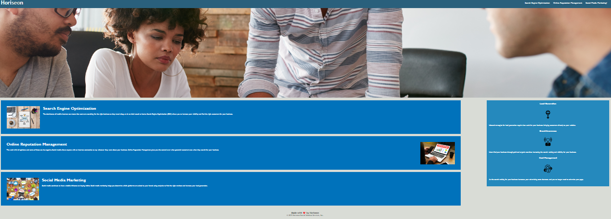

# Code-Refactor

## 📌 Description
I was hired by the Marketing Manager to refactor the Horiseon - Social Solution Services website. The primary goal was to improve the existing codebase, making it more accessible and optimized for a wider audience.

The website had several issues prior to the refactor, such as broken links and outdated HTML/CSS elements. Below are the changes made to improve the website and meet the criteria specified by the Marketing Manager:
* Updated the webpage title to "Horiseon | Social Solution Services" for clarity and SEO purposes.
* Meta viewport tag added to ensure the site is responsive across devices and screen sizes.
* Improved the HTML structure to ensure a logical order of elements and headings.
* Accessible 'alt' attributes were added to all images and icons to provide descriptive text in case of failed loading.
* Fixed navigation links and ensured the letters 'seo' in the main header are functioning properly.
* Replaced all non-semantic divs with more meaningful HTML elements.
* Added comments to both HTML and CSS files to provide clear explanations for other developers.
* Created a detailed README for documentation purposes.

## 🛠 Prerequisites
There are no prerequisites for this project.

## 📋 Criteria
This project was designed to meet accessibility standards. Key considerations include:
* Semantic HTML elements are used throughout the source code.
* The HTML structure follows a logical order, independent of styling and positioning.
* All images and icons have descriptive 'alt' attributes for better accessibility.
* Headings are in a sequential order for improved screen reader navigation.
* The title element is concise, descriptive, and relevant to the page content.

## 💻 Technologies Used
This project was built using:
* HTML
* CSS
* Gitbash
Note: The website layout is designed for desktop viewing, you may notice that some of the elements don't look like the mock-up at a resolution smaller than 768px.

## 🚀 Installation
No installation is required.

## 📚 Usage
No special usage instructions are required.

## 🔗 Live Demo & Repository
Application can be viewed here: 
* [Live](https://yvonnesarah.github.io/Code-Refactor/)

* [Repository](https://github.com/yvonnesarah/Code-Refactor)

## 🖼 Screenshot
Below is a preview of Code Refactor:

## 👥 Credit
N/A

## 📜 License
This project is open-source. For licensing details, please refer to the LICENSE file in the repository.

## 📬 Contact
You can reach me at 📧 yvonneadedeji.sarah@gmail.com.
